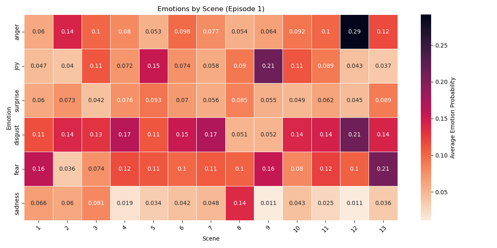
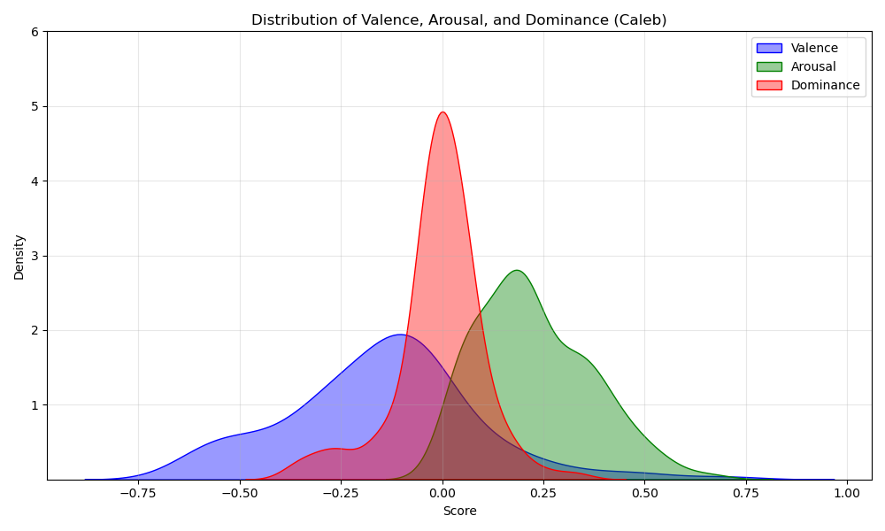
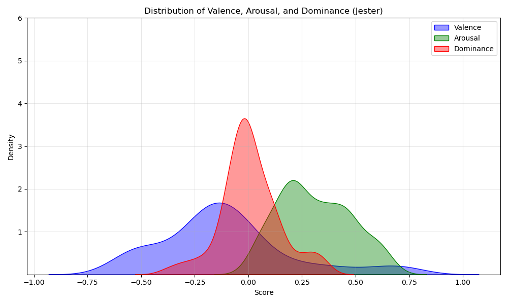

# ttrpg-sentiment

A sentiment analysis of Campaign 2, Episode 1: Curious Beginnings from Critical Role.

### Categorical Emotions

Emotional statements made by each main character (with neutral statements removed).

Emotions by scene.

### Dimensional Emotions

VAD Distribution - Beau

VAD Distribution - Caleb

VAD Distribution - Fjord

VAD Distribution - Jester

VAD Distribution - Molly

VAD Distribution - Nott

VAD Distribution - Yasha

### Directed Sentiment

Average sentiment directed between each main character.

